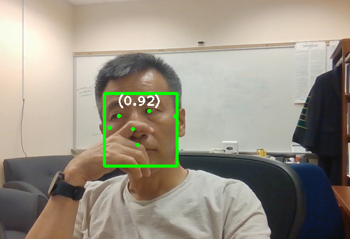

<h4>ver. Jan-2024</h4>

<h3>[Python] Five Open-source Face Detection Models </h3>

 <h4>1. Programming Environment</h4>

-   <u>Python Interpreter Version: 3.12</u> <em></em>
-   Libraries

    -   DlibDNN model
    -   HaarCascade model
    -   HogDetector model
    -   MediaPipeDnn model
    -   OpenCvDNN model

 <h4>2. Features</h4>

-   Demo Screen  
    

 <h4>3. Source Codes</h4>

-   DlibDNN.ipynb
-   HaarCascade.ipynb
-   HogDetector.ipynb
-   MediaPipeDnn.ipynb
-   OpenCvDNN.ipynb
