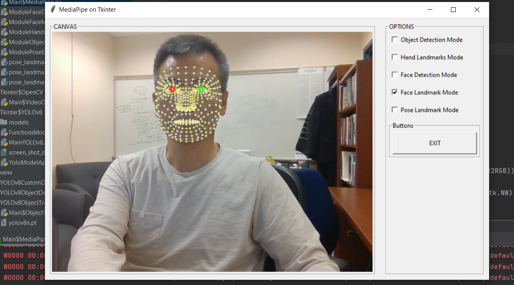

<h4>ver. April-2024</h4>

<h3>[Python] MediaPipe on Tkinter GUI </h3>

 <h4>1. Programming Environment</h4>

-   <u>Python Interpreter Version: 3.11</u> <em></em>
-   Libraries

    -   MediaPipe by Google
    -   Open-CV
    -   PIL
    -   Tkinter, etc.

 <h4>2. Features</h4>

-   Select modes: Object Detection, Hands, Face Detection, Facemesh, and Pose Estimation.

-   Demo Screen  
    

 <h4>3. Source Codes</h4>

-   Main$MediaPipe.py: main class module
-   ModuleFaceDetect.py: Face detection implementation
-   ModuleFaceMesh.py: Face Mesh implementation
-   ModuleHands.py: Hand landmarks detection implementation
-   ModuleObjectDetection.py: Object detection implementation
-   ModulePoseEstimation.py: Pose estimation implementation
