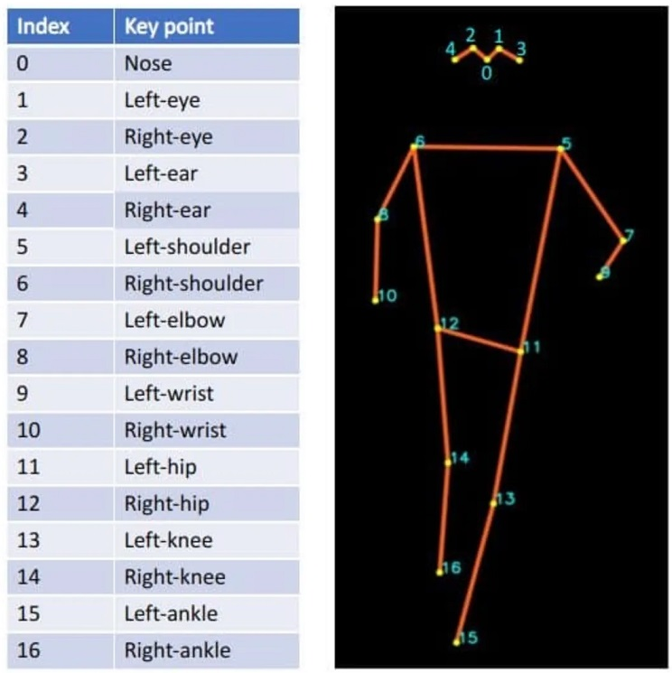

<h4>ver. Dec-2023</h4>
<style>
    h2 {color:Yellow; font-family: "Aerial"}
    h3 {color:cyan; font-family: "Aerial"}
    h4 {color:Orange; font-family: "Aerial"}
    p {margin-left: 20px; font-size: 15px}
    li {font-size: 15px}
</style>

<h2 > YOLO from Ultralytics</h2>
<p>$ Refer to .... <a href = "https://docs.ultralytics.com/">Ultralytics YOLO Document</a></p>

<h3>I. YOLO Tasks with Pre-Trained Model</h3>
<ul>
<li>Object Detection</li>
<p>$ Refer to .... <a href="https://docs.ultralytics.com/tasks/detect/">YOLO Object Detection</a> </p>

``` py
from ultralytics import YOLO

model = YOLO('Path to pre-trained detection model')

# check object class names in the pre-trainied model
print(model.names)

```

<li>Object Segmentation</li>
<p>$ Refer to .... <a href="https://docs.ultralytics.com/tasks/segment/">YOLO Object Segmentation</a> </p>

<li>Classification</li>
<p>$ Refer to .... <a href="https://docs.ultralytics.com/tasks/classify/">YOLO Classification</a> </p>

<li>Pose Estimation</li>
<p>$ Refer to .... <a href="https://docs.ultralytics.com/tasks/pose/">YOLO Pose Estimation</a> </p>

<p> </p>

<li>Bounding Box Object Detection</li>
<p>$ Refer to .... <a href="https://docs.ultralytics.com/tasks/obb/">YOLO Object Tracking</a> </p>
</ul>

