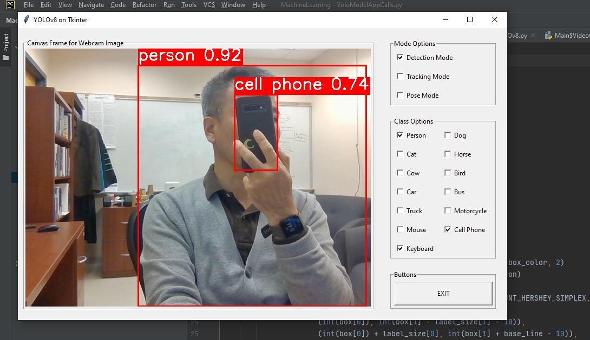

<h4>ver. April-2024</h4>

<h3>[Python] YOLOv8 on Tkinter GUI </h3>

 <h4>1. Programming Environment</h4>

-   <u>Python Interpreter Version: 3.11</u> <em></em>
-   Libraries

    -   ultralytics for YOLO
    -   Open-CV
    -   PIL
    -   Tkinter

 <h4>2. Features</h4>

-   Select modes: Detection, Tracking, and Pose Estimation
-   Select classes interested: person, dog, cat, cell-phone, etc.

-   Demo Screen  
    

 <h4>3. Source Codes</h4>

-   MainYOLOv8.py: main class module
-   YoloModelAppCalls.py: Yolo models implementation (pre-trained models only)
